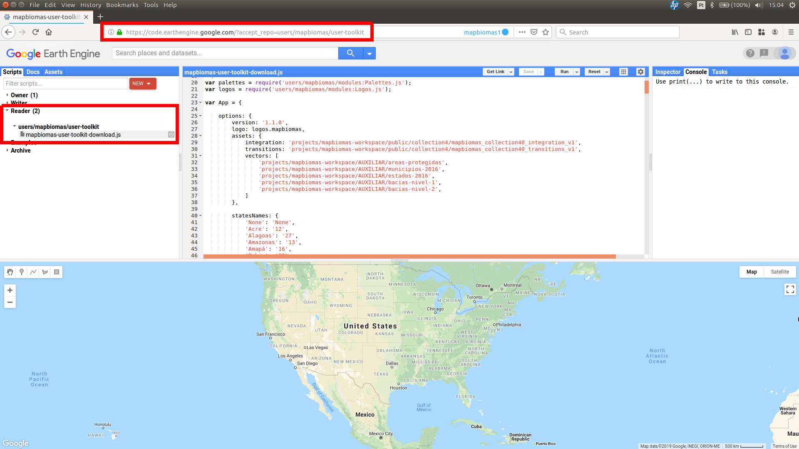
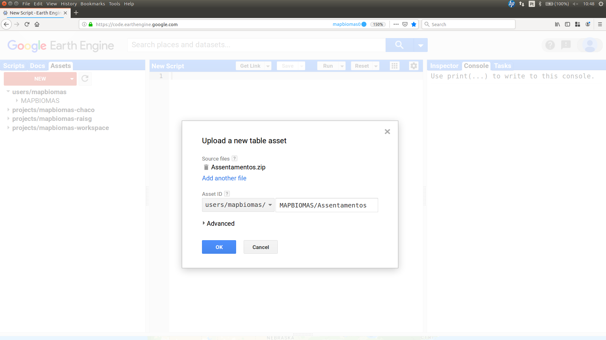
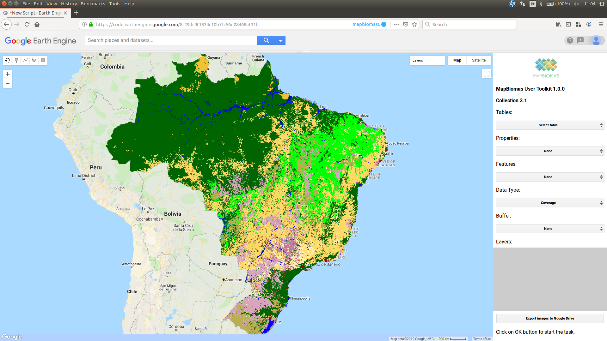
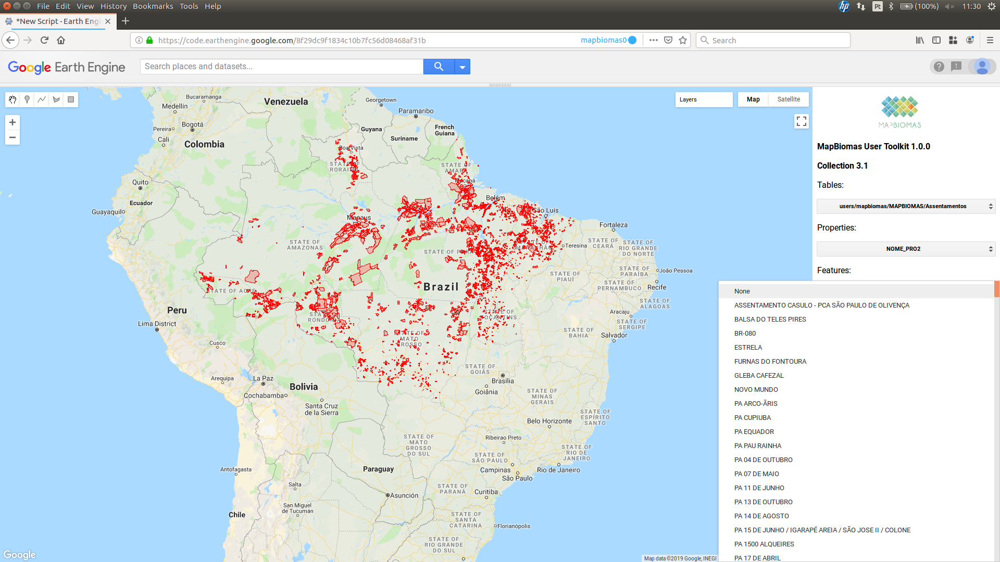
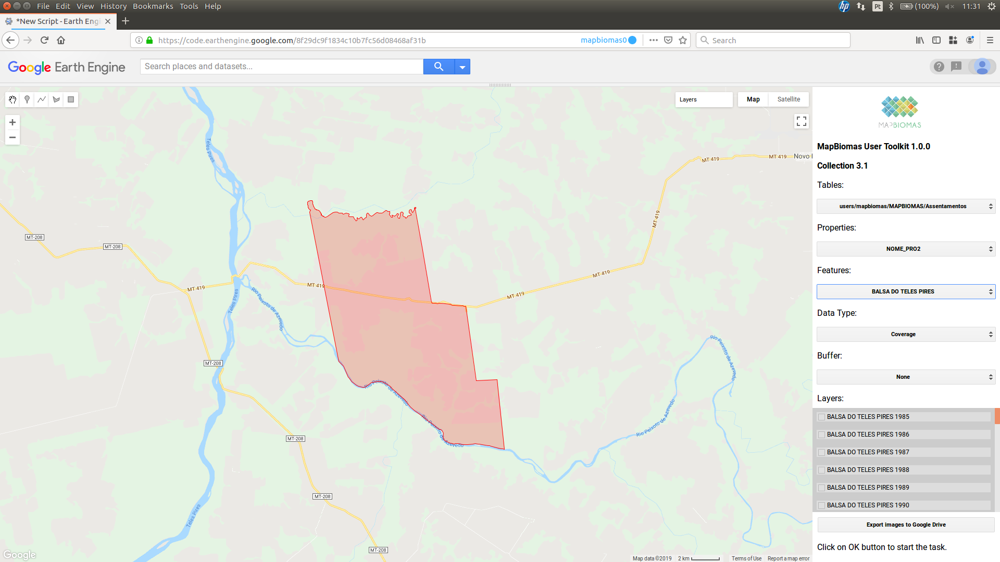
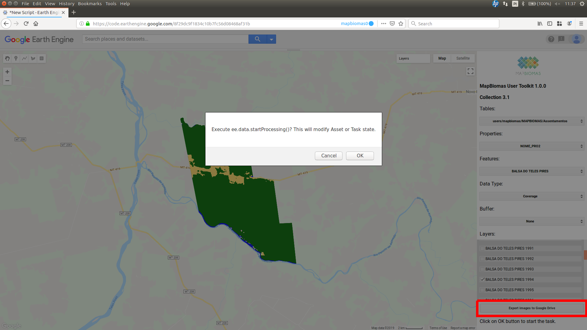

# MapBiomas User Toolkit

**_João Siqueira_**

# About

User Toolkit for MapBiomas data access in Google Earth Engine.

# How to use
<h4>1. Getting the code</h4>

Acess the **[repository](https://code.earthengine.google.com/?accept_repo=users/mapbiomas/user-toolkit)** directly in Google Earth Engine. The scripts will appears at **Reader Session** of your scripts tab.

<h4>2. Create a MAPBIOMAS folder</h4>
<ul>
  <li>Go to the Assets tab and click on the New menu. Then choose a Folder option.</li>
  <li>Selects your primary account if you have others linked to your structure.</li>
  <li>Create a MAPBIOMAS folder (all capital letters) in your assets structure.</li>
</ul>

<h4>3. Upload a new table asset</h4>

<ul>
  <li>In GEE vectors are called tables.</li>
  <li>Access the menu New > Table upload to add a table.</li>
  <li>Press the SELECT button to choose your shapefile. Browse to the file on your computer.
  <li>Remember to use files with the extension .shp, .shx, .prj, and .bdf. Alternatively, you can compress them into a zip file to upload.
  <li>Note that you must enter the MAPBIOMAS folder name to add the file directly within this folder.</li>
  <li>Click on OK to start the upload task.</li>
</ul>

<ul>
  <li>The table will appear inside the MAPBIOMAS folder. Press the refresh button to view all your new files.</li>
  <li>You can also move/copy a table asset from elsewhere in your structure into the MAPBIOMAS folder.</li>
</ul>

<h4>4. Accessing the data</h4>

<ul>
  <li>Now you run the script. Open the script in code editor and click on Run button.</li>
</ul>

<ul>
  <li>Select a table or choose one of the default tables.</li>
</ul>

<ul>
  <li>The table will be loaded on the map.</li>
  <li>In the properties menu, select the attribute that will identify each of the vector polygons.</li>
</ul>

<ul>
  <li>In the Features menu, select the polygon name you want to work with.</li>
</ul>

<ul>
  <li>The toolkit will zoom in to the selected polygon.</li>
  <li>It is possible to apply a buffer between 1 and 5 km. This buffer will only have effect on data export.</li>
</ul>

<ul>
  <li>Select from the Layers menu the maps you want to view and export. Layers are active in the menu and appear in the default list of layers in the code editor.</li>
</ul>

<h4>5. Exporting data</h4>
<ul>
  <li>To export the data to your Google Drive, click the Export images to Google Drive button. Wait for the task to be confirmed and click the OK button. Now just wait for the images to be saved to your Drive.</li>
  <li>A MAPBIOMAS folder will be created in your Google Driver root and all the mapbiomas data you exported will be there.</li>
</ul>

<h4>Enjoy!</h4>
:smile: