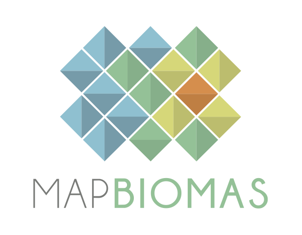
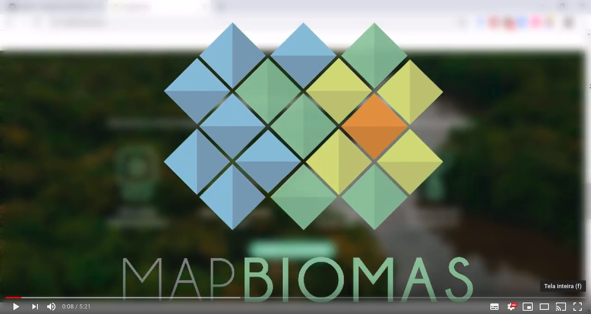
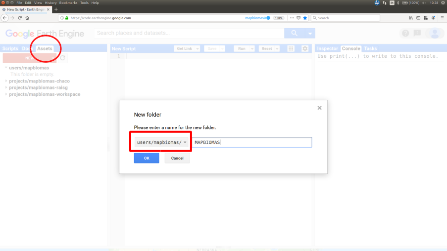
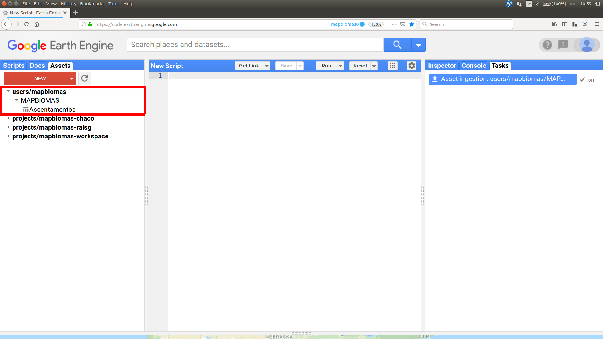
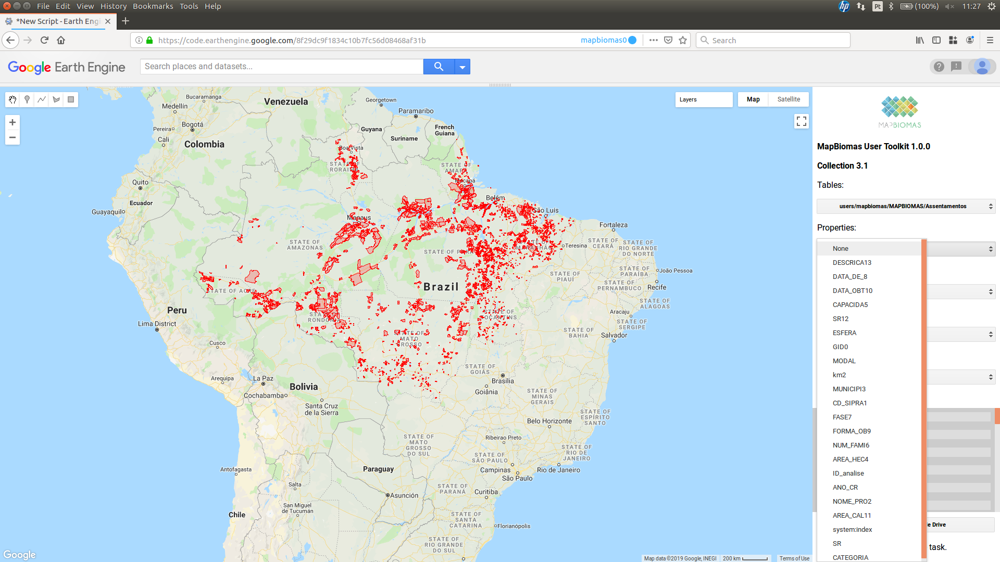
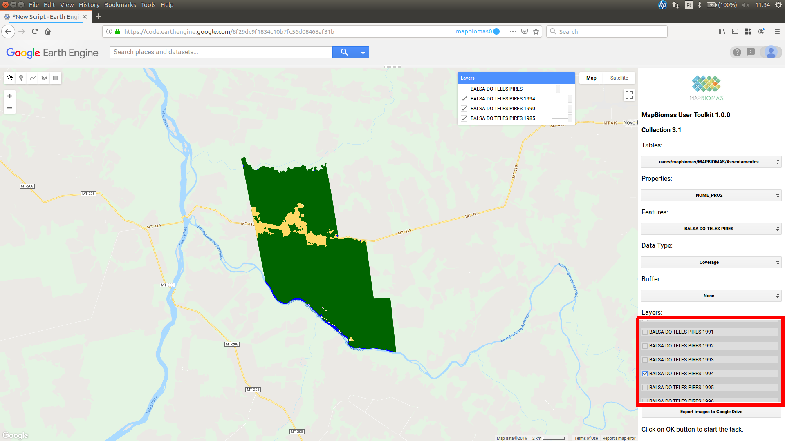
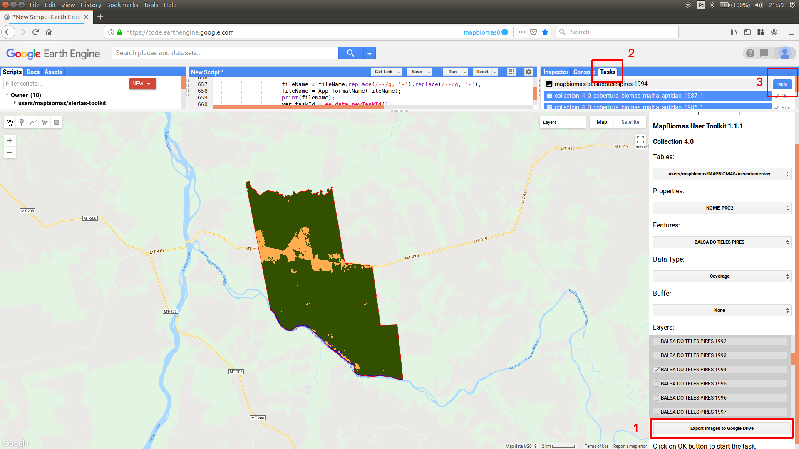
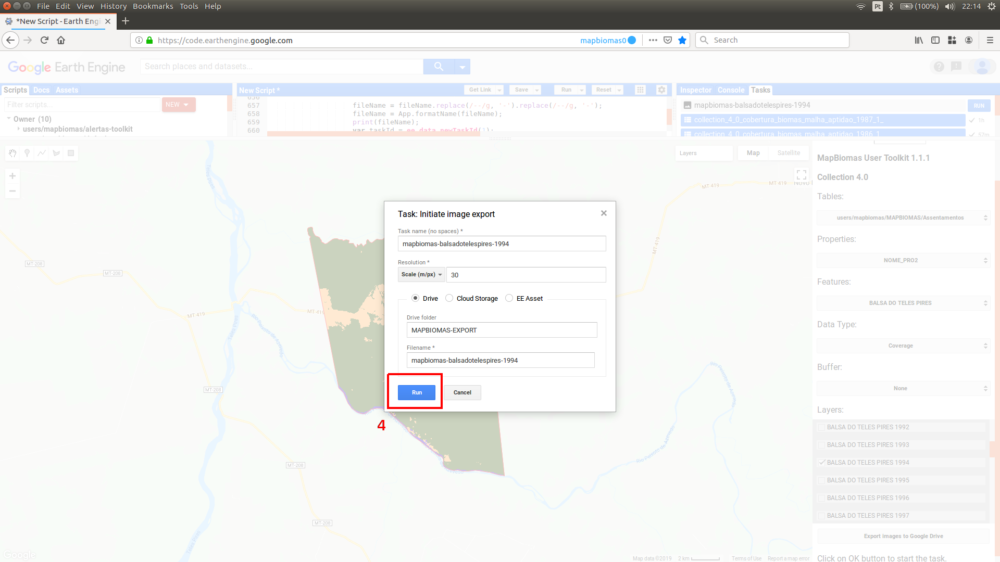

    
    <h1 class="title toc-ignore">MapBiomas User Toolkit</h1>
    <h4 class="author"><em>João Siqueira</em></h4>

# About

User Toolkit to download MapBiomas data with Google Earth Engine. This tutorial is about the script **mapbiomas-user-toolkit-lulc.js**

# Release History

* 1.0.0
    * Access and download data using user's vector
* 1.1.0
    * Updated for collection 4.0
* 1.1.1
    * Updated assets
* 1.1.2
    * New transitions periods
* 1.1.3
    * Updated for collection 4.1
* 1.3.0
    * Updated for collection 5.0
    * Export a csv file with areas per classe and year
* 1.3.1
    * Loads mapbiomas-chaco collection 2.0
* 1.3.2
    * Loads mapbiomas-brazil collection 5.0 quality
* 1.4.0
    * Loads mapbiomas-atlantic-forest collection 1.0
* 1.5.0
    * Loads mapbiomas-pampa collection 1.0
* 1.6.0
    * Loads mapbiomas-brazil collection 6.0
* 1.7.0
    * Loads mapbiomas-amazon collection 3.0

  <h1 class="title toc-ignore">Video tutorial (pt-br)</h1>
  

 <a href="https://www.youtube.com/channel/UCYXyUt65II43fvpeEJTmXZQ" target="_blank" rel="noopener noreferrer" >MapBiomas Brasil</a> | <a href="https://www.youtube.com/channel/UC3ezvJ-vmkUdcJ779-rR61Q" target="_blank" rel="noopener noreferrer">Solved Scholar</a> | <a href="https://www.youtube.com/user/luissadeck"  target="_blank" rel="noopener noreferrer">Luis Sadeck</a>

# How to use

<h4>1. Getting the code</h4>

Access the <a href="https://code.earthengine.google.com/?accept_repo=users/mapbiomas/user-toolkit" target="_blank" rel="noopener noreferrer">repository</a> directly in Google Earth Engine. The repository will appear at <b>Reader Session</b> of your scripts tab.

<h4>2. Create a MAPBIOMAS folder</h4>
<ul>
  <li>Go to the Assets tab and click on the New menu. Then choose the Folder option.</li>
  <li>Select your primary account if you have others linked to your structure. In this example, we see the mapbiomas account, but your structure will apper like this: users/MYACCOUNT. Examples: users/mary/, users/joao/, users/john/, users/tyler/.</li>
  <li>Create a MAPBIOMAS folder (all capital letters) in your assets structure.</li>
</ul>

<h4>3. Upload a new table asset</h4>

<ul>
  <li>In GEE vectors are called tables.</li>
  <li>Access the menu New > Table upload to add a table.</li>
  <li>Press the SELECT button to choose your shapefile. Browse to the file on your computer.
  <li>Remember to use files with the extension .shp, .shx, .prj, and .dbf. Alternatively, you can compress them into a zip file to upload.
  <li>Note that you must enter the MAPBIOMAS folder name to add the file directly within this folder.</li>
  <li>Click on OK to start the upload task.</li>
</ul>

<ul>
  <li>The table will appear inside the MAPBIOMAS folder. Press the refresh button to view all your new files.</li>
  <li>You can also move/copy a table asset from elsewhere in your structure into the MAPBIOMAS folder.</li>
</ul>

<h4>4. Accessing the data</h4>

<ul>
  <li>Run the script now. Open it in Code Editor and click the Run button.</li>
</ul>

<ul>
  <li>Select a table or choose one of the default tables.</li>
</ul>

<ul>
  <li>The table (vector) will be loaded on the map.</li>
  <li>In the Properties menu, select the attribute (column name) that will identify each of the vector polygons.</li>
</ul>

<ul>
  <li>In the Features menu, select the polygon name you want to work with.</li>
</ul>

<ul>
  <li>The toolkit will zoom into the selected polygon.</li>
  <li>It is possible to apply a buffer between 1 and 5 km. This buffer will only have effect on data export.</li>
</ul>

<ul>
  <li>Select from the Layers menu the years you want to view and export. Layers are active in the menu and appear in the default list of layers in the Code Editor.</li>
</ul>

<h4>5. Exporting data</h4>
<ul>
  <li>To export the data to your Google Drive, click the Export images to Google Drive button. Go to Tasks tab and click the RUN button.</li>
</ul>

<ul>
  <li>A confirmation box will pop up. Choose the Drive option and click the  button.</li>
</ul>

<ul>
  <li>Now just wait for the images to be saved to your Google Drive.</li>
  <li>A MAPBIOMAS-EXPORT folder will be created in your Google Drive root and all the mapbiomas data that you exported will be there.</li>
</ul>

<h4>6. Apply the MapBiomas color palette.</h4>
<ul>
  <li><a href="legend-colors/mapbiomas-legend-arcmap.lyr" target="_blank" rel="noopener noreferrer">Color file for ArcMap</a></li>
  <li><a href="legend-colors/mapbiomas-legend-qgis.qml" target="_blank" rel="noopener noreferrer">Color file for QGIS</a></li>
  <li><a href="legend-colors/mapbiomas-legend-excel.xlsx" target="_blank" rel="noopener noreferrer">Color file in Excel table</a></li>
</ul>

<h4>7. Transitions dates.</h4>
<ul>
  <li><a href="misc/transitions.md" target="_blank" rel="noopener noreferrer">Transitions table description</a></li>
</ul>

<h4>Enjoy!</h4>
:smile:

